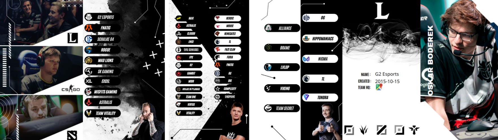

# 🎮 Janus – eSports Info App

  

##📋 Project Overview

Janus is an Android application developed as part of the Human-Computer Interaction course at the International Hellenic University (DI.PA.E). The goal was to build an informative app about eSports teams and tournaments in three game categories: League of Legends (LoL), CS:GO, and Dota II.

##🛠️ Tools & Technologies

    Android Studio

    Firebase (remote database)

    RoomAPI (local database)

    Stack Overflow

    Trello

    Discord

    Google Drive

    Adobe Photoshop 2020

    Adobe Premiere Pro 2020

    Canva

##🧪 Prototype Design

Before development, a storyboard prototype was designed using Google Slides, representing the app's user interaction flow. Each slide simulates a screen of the app, demonstrating how users navigate through features like:

    Intro video and main menu (Choose Game, Data)

    Game selection and team browsing

    Drawer navigation menu

    Team detail view, including map location and player information

##📱 Application Features
1. Start Page

    Two buttons:

        Games: navigates to game categories

        Data: navigates to data management options

    Intro video plays in the background

2. Categories

    User chooses between LoL, CS:GO, or Dota II using 3 ImageButtons

3. Teams

    Displays 10/25/10 teams respectively for each game category

    Each team selection is handled through an ImageButton linked to an integer (chosenteamnumber)

4. Drawer Menu

    Custom icons and smooth animations

    Enables quick switching between games

5. Chosen Team

    Displays:

        Team name, location, creation date

        Players by position (Lane buttons)

        Team's map location (Map button)

    Dynamically updates content based on selected team (getIntExtra logic)

6. Image Player

    Updates player images using:

    img.setImageResource(R.drawable.toplolg);

7. Map

    Google Maps integration using OnMapReadyCallback

    Each team location is marked using latitude and longitude variables

8. Landscape Support

    Custom layouts for landscape mode in every activity

🗃️ Local Data – RoomAPI

Entities:

    Teams, Players, eSports

Operations:

    Insert, Delete, Update, Query

    Queries include:

        Players over 25

        Teams with 5 members created after 2010

##☁️ Remote Data – Firebase

Firebase stores:

    Match data (time, date, score)

    Team info (name, roster, coach info)

    Tournament participation

Features:

    Insert matches using insert_esl.match

    Search queries (e.g., team with the most wins)

    Spinner-based selection of match details

##🔍 Data Collection

Data was sourced from:

    Official game sites

    Team Instagram pages (for location info)

    Riot Games official site (for LoL team history)

    Online encyclopedias and verified online resources
  - Number of players over 25
  - Teams with 5 members founded after 2010
  - Most winning team across all games
